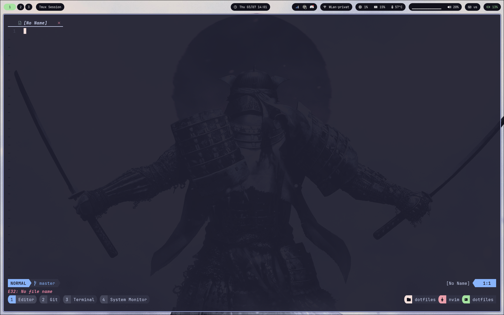

# salfel's dotfiles
This repo contains my dotfiles used on my daily machine. It includes all the tools needed for my daily work;

## Tools
- [nvim](https://github.com/neovim/neovim)
- [hyprland](https://github.com/hyprwm/Hyprland)
- [nixos](https://github.com/NixOS/nixpkgs)
- [tmux](https://github.com/tmux/tmux)
- [zsh](https://github.com/ohmyzsh/ohmyzsh)
- [waybar](https://github.com/Alexays/Waybar)
- and many more...

## Installation

### NixOS
Currently, my machine is a framework laptop, so the configuration can be installed using
```
sudo nixos-rebuild switch --flake .#framework
```

The home-manager config can be applied using
```
home-manager switch --flake .
```

### Dotfiles
The other dotfiles can be installed by moving all the config files to the .config folder or just running the following command in the root of this repo:
```
stow .
```

The following is a screenshot of my desktop:


